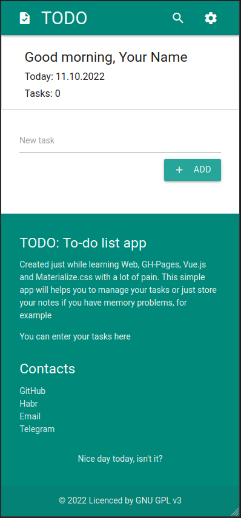

# todo-app

[App: ddan9.github.io/todo-app](https://ddan9.github.io/todo-app)

 

#### Demo:

 

#### todo:

- по кнопке: smooth scroll, скролл до последнего либо первого задания (состояния переключать), скрывать при скроллинге, скрывать пока скролл не в положении списка (либо сделать чтобы она работала как кнопка добавления, пока находится там), скрывать если фокус и ввод

 

- анимации (разные, добавления/удаления, переходов, перемещений задач, обновлений и т.д. для интерактива)
- на кнопку можно повесить прослушку, чтобы типо считывала направление скролла и выдавать попутное направление в конец в течение N секунд, либо если скролла нет, выдавать функционал

 

- при нажатии на совет менять его
- выбор определенных и удаление
- детект зажатия на элементе и работа с этим (vue.js)
- помечать как важные (звездочка/обрамление/цвет)
- попытаться все параметры ото всюду запихнуть в одно место
- давать найденным элементам ид и скроллить туда?
- менять совет при нажатии на него
- translate alert js?
- историю тасков
- большие таски, разворот при нажатии, форматирование при вводе
- если открыто несколько вкладок приложения, не обновляются данные
- вкладки с отдельными базами в меню
- можно на каждое задание вешать якорь и скроллить к якорям после манипуляций (например после добавления)

 

- настройки как отдельная часть, по-нормальному
- темы в настройках

 

- позже: кастомные варианты всплывающих меню (на materialize) вместо alert-js-like (некоторые так пока работают (отсутствие инета, поиск, настройки, вопрос перед удалением(и), смена имени, редактор записей))
